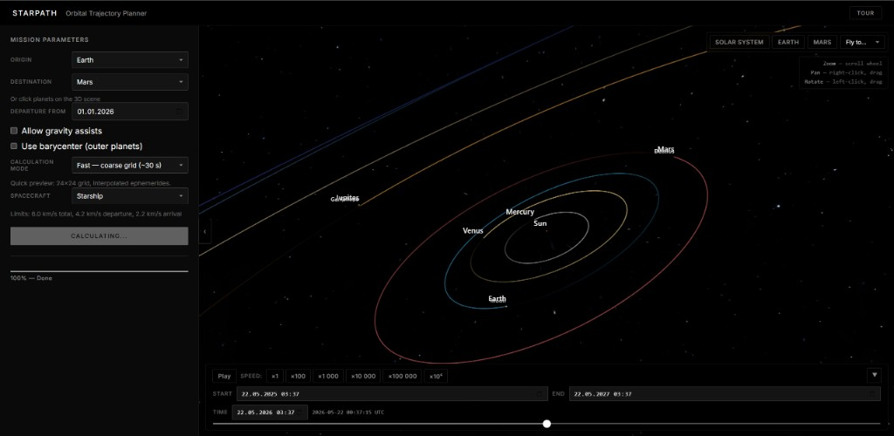
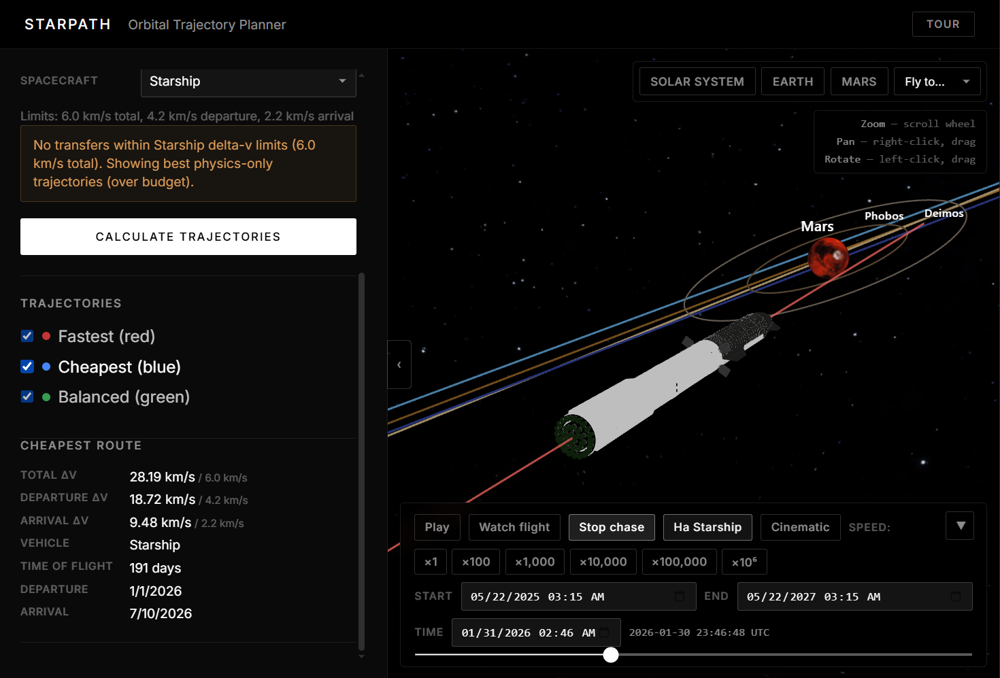
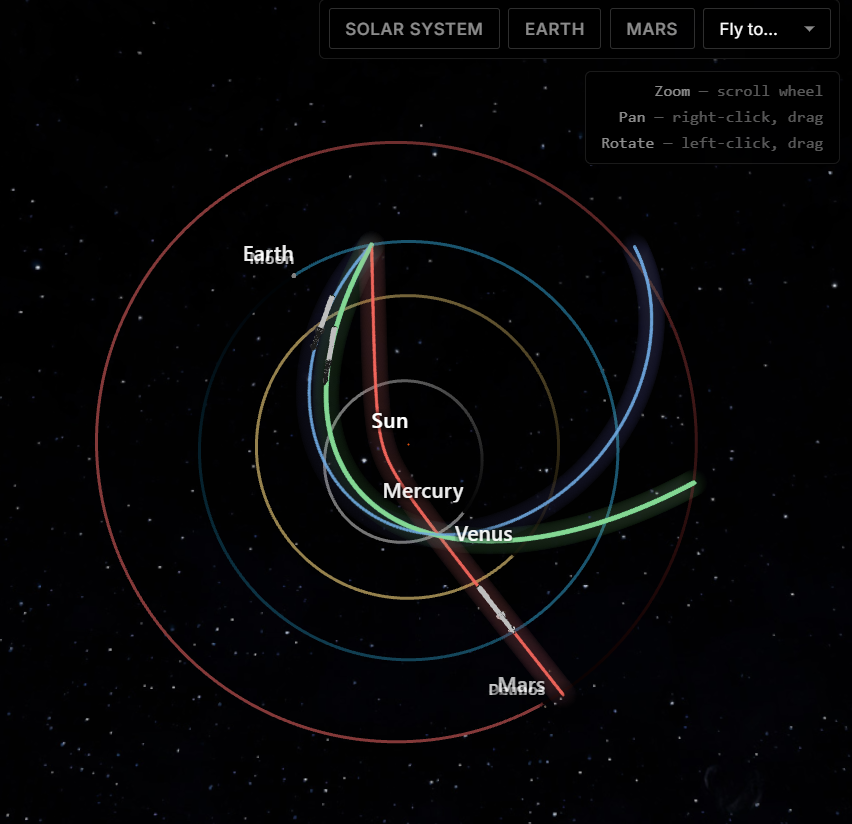

# StarPath

Orbital trajectory planner with **Astropy + lamberthub** physics backend and **Three.js + React Three Fiber** 3D visualization.

Demo: [https://www.youtube.com/watch?v=1G7M-L6jR2Y](https://www.youtube.com/watch?v=1G7M-L6jR2Y)

## Screenshots

<p align="left">
  
</p>
<p align="left">
  
</p>
<p align="left">
  
</p>

## Features

- Lambert porkchop grid for Earth/Mars and other planet pairs
- Three optimized routes: fastest, cheapest, balanced
- Async calculation via Celery + Redis
- CZML export with HERMITE interpolation for smooth trajectory animation
- React UI with interactive 3D scene, porkchop heatmap
- Gravity assist routing (VVEJGA corridors)
- Launch window warnings based on synodic periods

## Stack


| Layer    | Technology                                      |
| -------- | ----------------------------------------------- |
| Physics  | Astropy ephemerides + lamberthub (Lambert/Izzo) |
| API      | FastAPI                                         |
| Queue    | Celery + Redis                                  |
| CZML     | czml3                                           |
| Frontend | React + Vite + TypeScript                       |
| 3D       | Three.js + React Three Fiber                    |
| Charts   | Plotly.js                                       |


## Hosts and ports


| Service  | Local dev (`.\start.ps1`)                                    | Docker Compose                                                                                                     |
| -------- | ------------------------------------------------------------ | ------------------------------------------------------------------------------------------------------------------ |
| UI       | [http://localhost:5173](http://localhost:5173)               | [http://localhost](http://localhost) (nginx) or [http://localhost:5173](http://localhost:5173)                     |
| API      | [http://localhost:8000](http://localhost:8000)               | [http://localhost:8000](http://localhost:8000)                                                                     |
| API docs | [http://localhost:8000/docs](http://localhost:8000/docs)     | [http://localhost:8000/docs](http://localhost:8000/docs)                                                           |
| Health   | [http://localhost:8000/health](http://localhost:8000/health) | [http://localhost/health](http://localhost/health) or [http://localhost:8000/health](http://localhost:8000/health) |
| Redis    | `localhost:6379`                                             | `redis:6379` (internal to compose network)                                                                         |
| Flower   | —                                                            | [http://localhost:5555](http://localhost:5555)                                                                     |


In local dev, Vite proxies `/api` and `/health` to `http://localhost:8000`, so the frontend can call the API with an empty `VITE_API_BASE_URL`.

## Quick Start

### One command (Windows)

```powershell
.\start.ps1
```

Or double-click `start.bat`. The script will:

1. Copy `.env.example` → `.env` if missing
2. Start **Redis** in Docker (`starpath-redis`) on `localhost:6379`
3. Open 3 windows: **Celery worker**, **API** (port 8000), **Frontend** (port 5173)

Stop Redis and worker processes: `.\start.ps1 -Stop`

Full stack in Docker Compose: `.\start.ps1 -Docker`

### Prerequisites

- Python 3.12+ with `.venv` in project root
- Node.js 20+
- Docker Desktop (for Redis in local mode, or full `-Docker` mode)

Create the virtual environment once:

```powershell
python -m venv .venv
.\.venv\Scripts\pip install -e "backend[dev]"
```

### Manual start

```powershell
# From project root — env (once)
copy .env.example .env

# Terminal 1 — Redis
docker run -d --name starpath-redis -p 6379:6379 redis:7-alpine

# Terminal 2 — Worker (Windows: -P solo required)
cd backend
$env:REDIS_URL="redis://localhost:6379/0"
$env:CELERY_BROKER_URL="redis://localhost:6379/0"
$env:CELERY_RESULT_BACKEND="redis://localhost:6379/1"
$env:CZML_STORAGE_DIR="..\backend\data\czml"
..\.venv\Scripts\celery.exe -A app.tasks.celery_app worker -Q calculations -P solo -c 1 --loglevel=info

# Terminal 3 — API
cd backend
..\.venv\Scripts\uvicorn.exe app.main:app --reload --port 8000

# Terminal 4 — Frontend
cd frontend
npm install
npm run dev
```

On Linux/macOS, omit `-P solo` on Celery and use `.venv/bin/` instead of `.venv\Scripts\`.

Open [http://localhost:5173](http://localhost:5173)

## API


| Method | Endpoint                        | Description                             |
| ------ | ------------------------------- | --------------------------------------- |
| GET    | `/health`                       | Redis + Celery worker status            |
| POST   | `/api/v1/calculate`             | Submit mission calculation              |
| GET    | `/api/v1/task/{id}`             | Poll task status and results            |
| GET    | `/api/v1/preview`               | Lightweight porkchop point preview      |
| GET    | `/api/v1/vehicles`              | List vehicle profiles                   |
| GET    | `/api/v1/vehicles/{id}`         | Single vehicle profile                  |
| GET    | `/api/v1/ephemeris/sample`      | Sample body positions for the 3D viewer |
| GET    | `/api/v1/czml/{task_id}/{kind}` | Download CZML trajectory                |


Interactive docs: [http://localhost:8000/docs](http://localhost:8000/docs)

## License

MIT